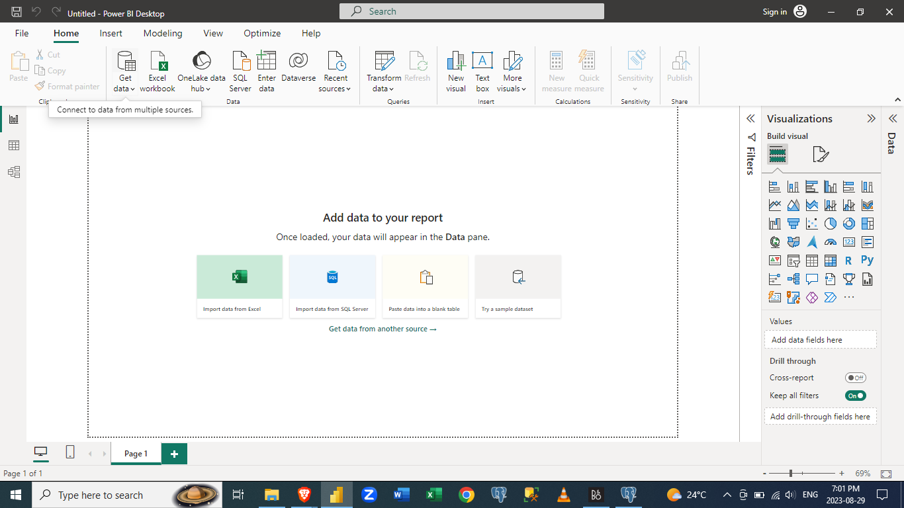
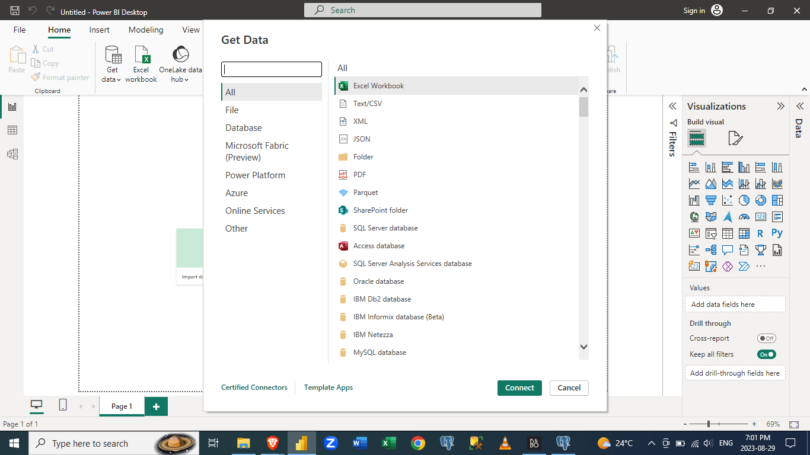
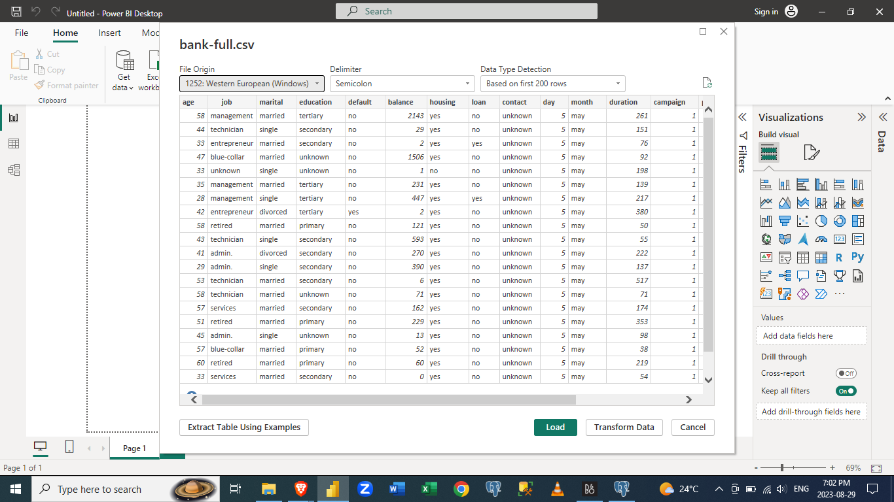
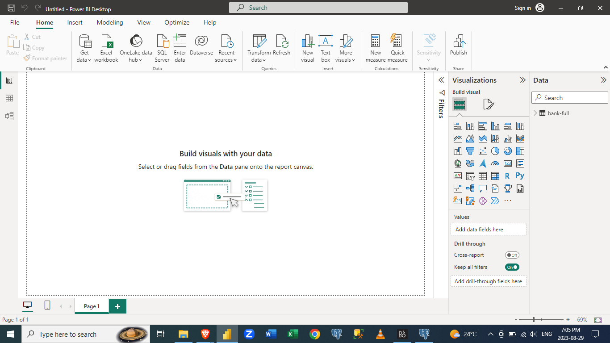
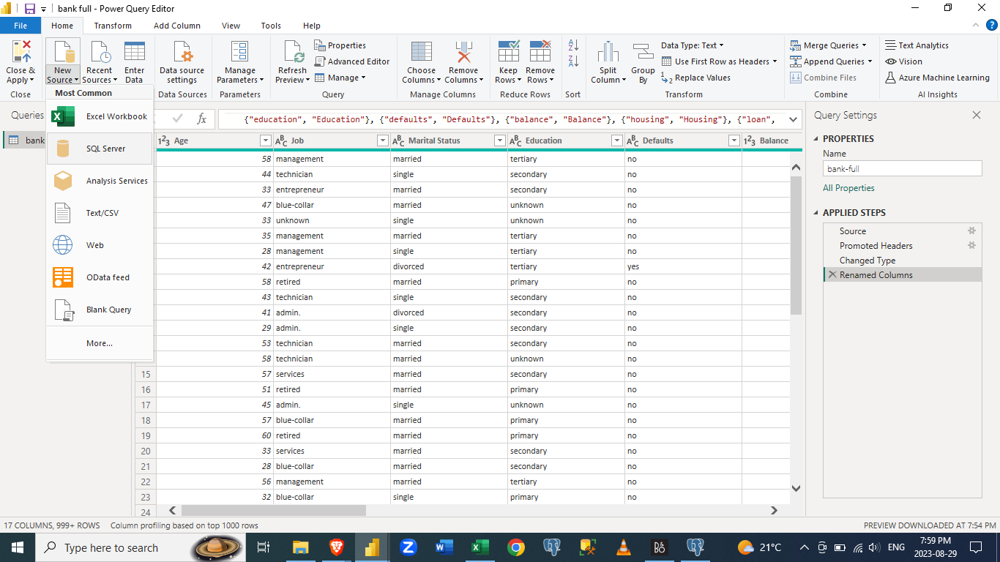
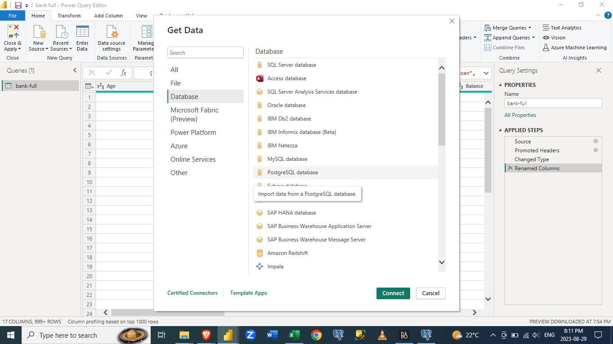
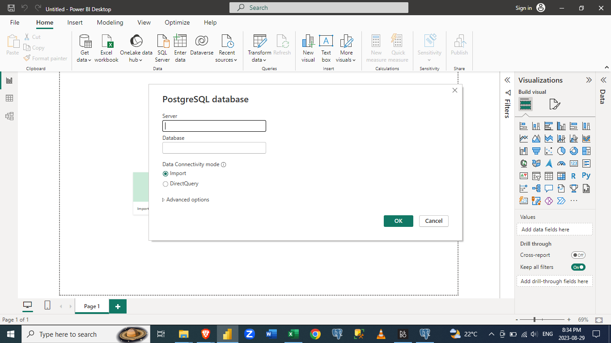
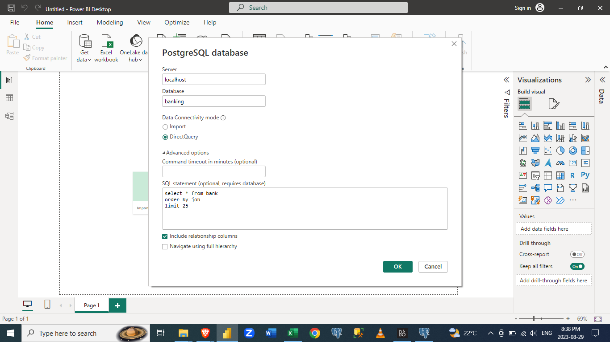
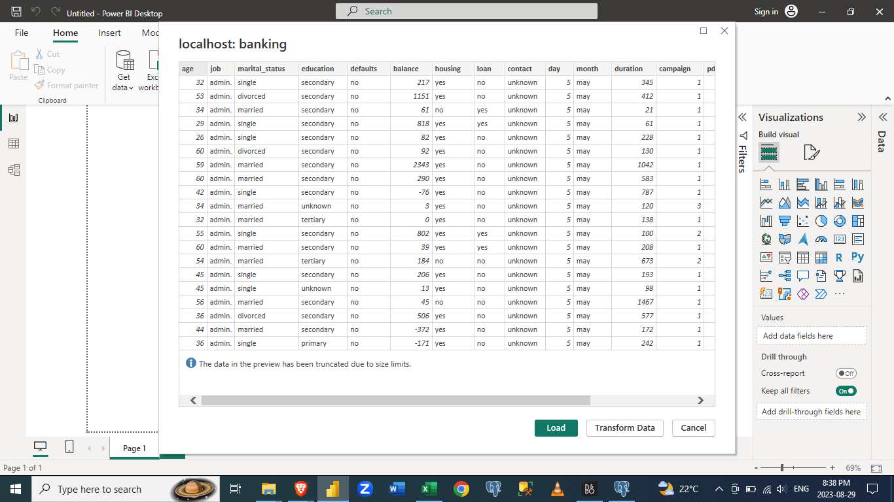
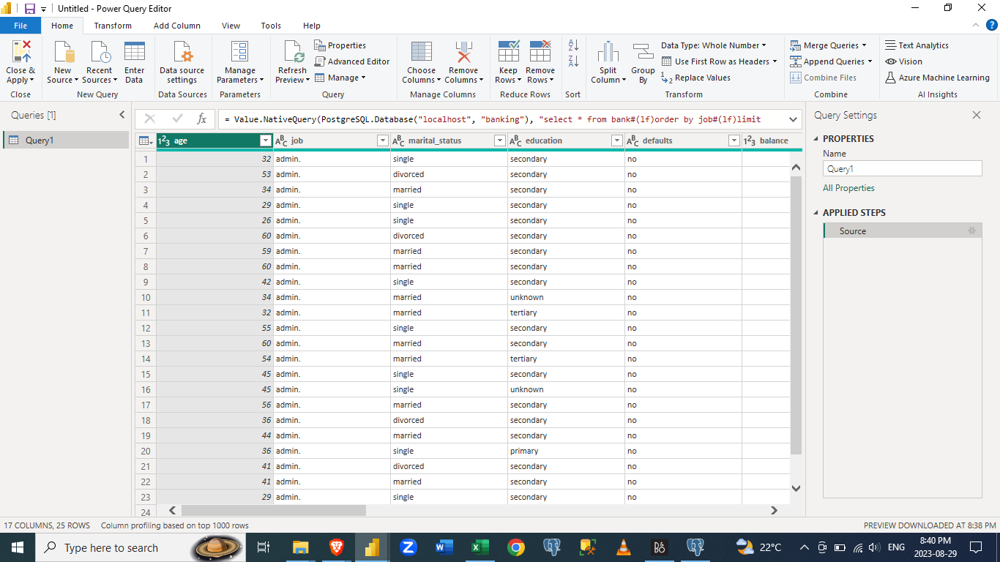

# How-to-load-data-files-into-Microsoft-Power-BI
How to load data files into Power BI in order to visualize your data

## Introduction
Welcome to the "How to Load Files into Microsoft Power BI" project repository! This repository serves as a comprehensive guide to help users efficiently load various types of files into Microsoft Power BI for practical data analysis and visualization. Whether you're a beginner or an experienced Power BI user, this repository provides step-by-step instructions and insights to enhance your data manipulation skills.

## Problem Statement
Loading diverse data files into Microsoft Power BI can be challenging for many users. Using the repository, you can learn how to import and transform files into Power BI, such as CSV, Excel, and more. In this way, we aim to empower users to utilize Power BI to its full potential for data-driven decision-making.

## Key Topics Covered
Loading CSV Files: Step-by-step guide to import Comma-Separated Values (CSV) files into Power BI.  
Connecting to Databases: A walkthrough of connecting to databases and retrieving data.

## Analysis
The analysis focuses on breaking down the complex process of loading files into Power BI into easy-to-follow steps. We examine specific file formats, demonstrate actions within Power BI, and examine best practices for data transformation. By adopting a hands-on approach, users can seamlessly import their data into Power BI and derive meaningful insights.  
The following steps are used to load files into the Power BI Desktop. Note, that we can import various types of data files into Power BI.  We are just going to use a .csv file first.  

 1. Open your Microsoft Power BI Desktop.
 

 
 2. Then click on Get data, then this dialogue box appears. 

 
 
 3. Choose the datatype and source of your data. For this example, I picked a .csv file that is stored on my system.
 

 
 4. Then load the file into Power BI.
 

 
 5. The file is now loaded into Power BI. You can check your file on the Power Query Editor. The Power Query Editor is where you can make necessary and important changes to your data.
 

 We can also import files into Power BI straight from SQL servers, be it Postgres, Microsoft, Oracle, or MySQL.  
 To load files into files into Microsoft Power BI Desktop straight from the SQL server.
 
 1. Open the Microsoft Power BI Desktop or with it still open, click on New Source or Get Data, select the database and then pick the SQL Server that best suits you or SQL Server from where you want to get your data.
 

 
 2. I made use of Postgres SQL Server, this dialogue box shows up and then you have to put in your Server Name as well as the name of the database as it appears in your SQL server.
 
 
 
 3. Then you can choose the import option or the Direct Query option. The Import option just imports the whole file straight into the Desktop while the Direct Query option makes use of queries to maybe simplify your data to your need/taste.
 

 
 4. You then select the Load option or Transform option if you want to clean your data.
 
 
 
 5.  The data is now loaded into the desktop.

## Conclusion
In conclusion, the "How to Load Files into Microsoft Power BI" repository equips users with the necessary skills to efficiently import and transform various types of data files. By providing comprehensive guides, practical examples, and insights into Power BI's capabilities, Users can streamline their data analysis processes and unlock valuable insights.  
I invite you to explore the repository, follow the guides, and enhance your proficiency in leveraging Microsoft Power BI for data analysis and visualization. Feel free to contribute, ask questions, and share your experiences to foster a collaborative learning environment.

